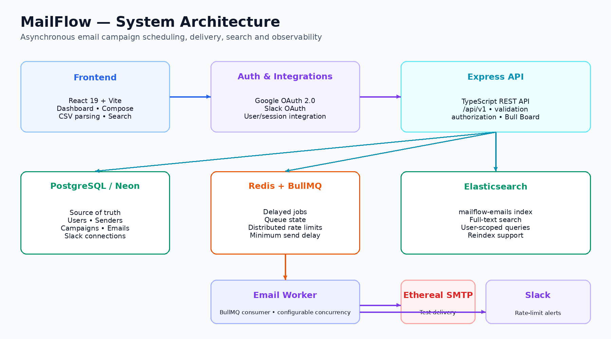
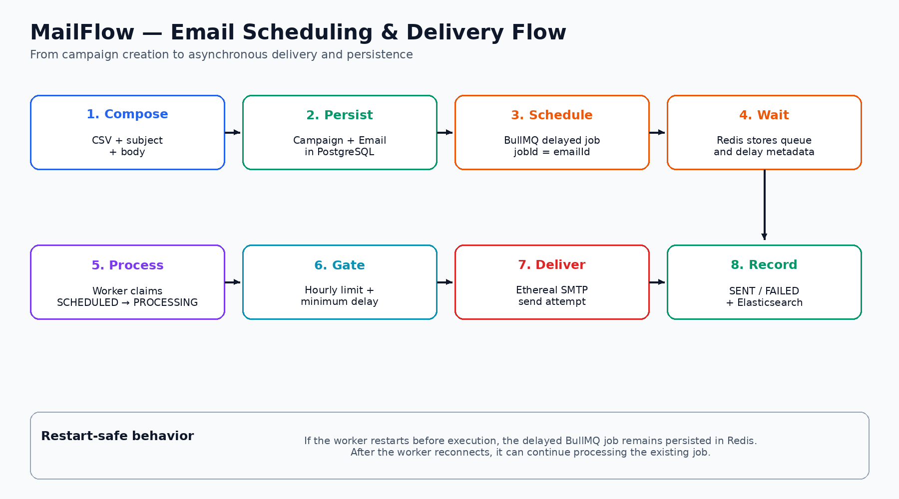
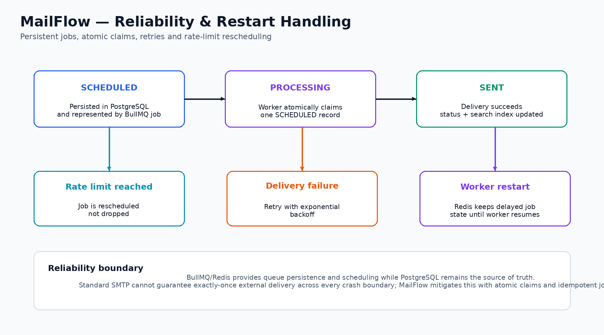

# MailFlow

### Production-Oriented Email Campaign Scheduling & Delivery Platform

MailFlow is a full-stack email campaign scheduling and delivery platform designed around asynchronous processing, persistent scheduling, distributed rate limiting, reliable background workers, searchable email history, and operational observability.

It allows an authenticated user to create bulk email campaigns, upload recipients through CSV, schedule delivery, configure minimum inter-email delays and hourly sending limits, monitor jobs through Bull Board, search email records through Elasticsearch, and receive Slack notifications when sending limits are reached.

> **Assignment note:** The default development SMTP provider is Ethereal Email. Ethereal provides test delivery/preview behavior rather than production delivery to arbitrary external inboxes.

---

## Table of Contents

- [Problem](#problem)
- [Solution](#solution)
- [Key Features](#key-features)
- [Architecture](#architecture)
- [End-to-End Email Flow](#end-to-end-email-flow)
- [Reliability and Restart Handling](#reliability-and-restart-handling)
- [Technology Stack](#technology-stack)
- [Project Structure](#project-structure)
- [Prerequisites](#prerequisites)
- [Environment Variables](#environment-variables)
- [Local Setup](#local-setup)
- [Running the Application](#running-the-application)
- [Authentication](#authentication)
- [Campaign and Scheduling Workflow](#campaign-and-scheduling-workflow)
- [Rate Limiting and Minimum Delay](#rate-limiting-and-minimum-delay)
- [Email Delivery Worker](#email-delivery-worker)
- [Elasticsearch Search](#elasticsearch-search)
- [Slack Integration](#slack-integration)
- [Bull Board](#bull-board)
- [API Overview](#api-overview)
- [Security and Data Isolation](#security-and-data-isolation)
- [Testing and Verification](#testing-and-verification)
- [Production Readiness](#production-readiness)
- [Known Limitations](#known-limitations)
- [Demo Flow](#demo-flow)

---

## Problem

Bulk email scheduling becomes difficult when the system must do more than simply send messages immediately.

A reliable implementation needs to:

- persist scheduled work across application/worker restarts;
- avoid database polling or cron-based scheduling;
- process delivery asynchronously;
- prevent duplicate processing when workers run concurrently;
- enforce an hourly sending limit;
- enforce a minimum delay between individual sends;
- reschedule jobs when limits are reached instead of dropping them;
- provide searchable email history;
- expose queue/worker observability;
- isolate one user's campaigns and email data from another user's data.

MailFlow addresses these requirements with a PostgreSQL source of truth, Redis/BullMQ delayed jobs, a dedicated worker, Redis-backed rate limiting, Elasticsearch search, and an authenticated web dashboard.

---

## Solution

The application separates the responsibilities of the API, persistent storage, queue, worker, and external integrations.

```text
User
  |
  v
React Dashboard
  |
  v
Express API
  |
  +---------------------> PostgreSQL
  |
  +---------------------> Redis / BullMQ
                              |
                              v
                         Email Worker
                              |
                    +---------+---------+
                    |                   |
                    v                   v
               SMTP Delivery      Elasticsearch
                                      |
                                      v
                                  Search UI

Google OAuth  ------------------> Authentication
Slack OAuth   ------------------> Slack connection
Rate limit reached -------------> Slack notification
Bull Board    ------------------> Queue observability
```

---

## Key Features

### Authentication

- Google OAuth 2.0 login.
- Authenticated dashboard access.
- User profile information including name, email and avatar.
- Logout and protected application routes.

### Campaign Management

- Create campaigns from the dashboard.
- Select a configured sender.
- Upload recipient CSV files.
- Parse and validate recipient data.
- Preview recipients before scheduling.
- Configure subject and email body.
- Configure start time.
- Configure minimum inter-email delay.
- Configure hourly email limit.

### Asynchronous Scheduling

- BullMQ delayed jobs backed by Redis.
- Scheduled jobs are not dependent on an in-memory JavaScript timer.
- No cron-based scheduler.
- No `node-cron`.
- No database polling loop.
- Email ID is used as the BullMQ job ID for idempotency.

### Reliable Worker Processing

- Dedicated BullMQ worker.
- Configurable worker concurrency.
- Atomic transition from `SCHEDULED` to `PROCESSING`.
- Successful delivery transitions the email to `SENT`.
- Failed processing transitions to `FAILED` after the configured retry behavior.
- Exponential retry/backoff is used for retryable delivery failures.

### Distributed Rate Limiting

- Configurable hourly email limit.
- Redis-backed coordination across concurrent workers.
- Minimum delay between consecutive sends.
- Jobs are rescheduled when capacity is unavailable.
- Rate-limited jobs are not silently discarded.

### Elasticsearch Search

- Email records are indexed in Elasticsearch.
- Search supports recipient, subject and body data according to the implemented mappings.
- Queries are scoped to the authenticated user's data.
- A reindex utility is available for synchronizing database records with the search index.

### Slack Integration

- Slack OAuth connection flow.
- Store and manage a user's Slack connection.
- Disconnect/reconnect support.
- Non-blocking notification when the configured sending limit is reached.

### Queue Observability

- Bull Board exposes the BullMQ queue.
- Inspect delayed, active, completed and failed jobs.
- Useful for debugging scheduling and worker behavior.

---

# Architecture

## System Architecture



### Core responsibilities

| Component | Responsibility |
|---|---|
| React + Vite | Dashboard, compose flow, CSV handling and user interaction |
| Express API | Authentication, authorization, campaigns, emails, senders, integrations and search APIs |
| PostgreSQL | Persistent source of truth for users, campaigns, emails, senders and Slack connections |
| Redis | BullMQ job state and distributed rate-limiting coordination |
| BullMQ | Delayed scheduling and asynchronous job management |
| Worker | Claims and processes email jobs |
| Ethereal SMTP | Development/test SMTP delivery |
| Elasticsearch | Searchable email index |
| Google OAuth | User authentication |
| Slack OAuth | Slack connection and notifications |
| Bull Board | Queue monitoring and operational visibility |

---

# End-to-End Email Flow



The normal flow is:

1. The user authenticates with Google.
2. The user opens the campaign composer.
3. Recipients are uploaded through CSV.
4. The frontend validates and previews recipients.
5. The API persists the campaign and email records in PostgreSQL.
6. The scheduler creates delayed BullMQ jobs.
7. Redis maintains the queue and delay state.
8. At the scheduled time, the worker receives the job.
9. The worker atomically claims the email.
10. The distributed rate limiter checks hourly capacity and minimum delay.
11. If the send is allowed, the worker sends through SMTP.
12. The email status is updated to `SENT` or `FAILED`.
13. Email data is indexed/updated in Elasticsearch according to the implemented indexing flow.
14. If the rate limit is reached, the job is rescheduled instead of dropped.
15. Slack can receive a rate-limit notification when a connected workspace is configured.

---

# Reliability and Restart Handling



MailFlow separates durable state from the lifetime of an individual Node.js process.

### Persistent scheduling

Scheduled work is represented by BullMQ delayed jobs backed by Redis rather than an in-memory timer.

### Atomic worker claim

Before sending, the worker transitions an email from:

```text
SCHEDULED
    |
    v
PROCESSING
```

using an atomic database update.

This prevents two concurrent workers from successfully claiming the same `SCHEDULED` email.

### Retry behavior

Retryable processing failures use BullMQ retry/backoff behavior according to the worker configuration.

### Rate-limit rescheduling

If the Redis-backed limiter reports that a send cannot happen yet, the worker calculates the required delay and reschedules the BullMQ job.

The email remains scheduled rather than being discarded.

### Worker restart

If the worker is stopped while delayed work is waiting, the job remains in Redis/BullMQ. After the worker starts again and reconnects to Redis, the pending job can be processed.

### Exactly-once boundary

Standard SMTP does not provide a distributed transaction that can atomically commit both remote mail acceptance and the local database state. Therefore, an absolute exactly-once external delivery guarantee cannot be established across every possible crash boundary.

MailFlow mitigates duplicate processing with persistent job IDs, atomic database claims, status checks and retry/idempotency safeguards.

---

# Technology Stack

## Backend

- Node.js
- Express
- TypeScript
- PostgreSQL
- Prisma ORM
- BullMQ
- Redis
- Elasticsearch
- Passport.js / Google OAuth
- JWT-based authentication
- Nodemailer
- Ethereal SMTP
- Zod
- Helmet
- CORS
- Bull Board

## Frontend

- React
- Vite
- TypeScript
- Tailwind CSS
- Axios
- TanStack React Query
- React Hook Form
- Zod
- PapaParse
- Lucide React

## Infrastructure

- Docker Compose
- Redis container
- Elasticsearch container
- Neon PostgreSQL for the database

---

# Project Structure

The repository is organized into separate frontend, backend and infrastructure responsibilities.

```text
MailFlow/
├── README.md
├── docker-compose.yml
├── package.json
├── scripts/
│   └── clean-ports.cjs
│
├── backend/
│   ├── package.json
│   ├── prisma/
│   │   └── schema.prisma
│   └── src/
│       ├── server.ts
│       ├── app.ts
│       ├── config/
│       ├── controllers/
│       ├── middleware/
│       ├── queues/
│       ├── repositories/
│       ├── routes/
│       ├── services/
│       ├── utils/
│       └── workers/
│
└── frontend/
    ├── package.json
    ├── vite.config.ts
    └── src/
        ├── App.tsx
        ├── components/
        ├── pages/
        ├── services/
        └── ...
```

> The exact file list should be treated as implementation-dependent; the structure above highlights the main architectural boundaries.

---

# Prerequisites

Install the following before running MailFlow locally:

- Node.js
- npm
- Docker Desktop
- A PostgreSQL database, such as Neon
- Google OAuth credentials for authentication
- Slack OAuth application credentials if Slack integration is being tested
- Ethereal SMTP credentials for development email delivery

Never commit credentials or `.env` files.

---

# Environment Variables

Use environment variables for local and production configuration.

## Backend

The following variables are used by the implemented configuration. Verify the exact current configuration before creating a new environment file:

```env
NODE_ENV=development
PORT=5000

DATABASE_URL=your-postgresql-connection-string

REDIS_HOST=localhost
REDIS_PORT=6379

ELASTICSEARCH_URL=http://localhost:9200

FRONTEND_URL=http://localhost:5173

GOOGLE_CLIENT_ID=your-google-client-id
GOOGLE_CLIENT_SECRET=your-google-client-secret
GOOGLE_CALLBACK_URL=http://localhost:5000/api/auth/google/callback

JWT_SECRET=your-jwt-secret

WORKER_CONCURRENCY=5
MIN_EMAIL_DELAY_MS=2000
MAX_EMAILS_PER_HOUR=100

ETHEREAL_HOST=smtp.ethereal.email
ETHEREAL_PORT=587
ETHEREAL_USER=your-ethereal-user
ETHEREAL_PASSWORD=your-ethereal-password

SLACK_CLIENT_ID=your-slack-client-id
SLACK_CLIENT_SECRET=your-slack-client-secret
SLACK_REDIRECT_URI=your-local-slack-callback
```

Only use variables that exist in the current application configuration. Never copy real credentials into this file or into Git.

## Frontend

```env
VITE_API_URL=http://localhost:5000/api/v1
```

For production, replace the local API URL with the deployed backend URL.

---

# Local Setup

## 1. Install dependencies

From the project root:

```bash
npm --prefix backend install
npm --prefix frontend install
```

## 2. Configure environment variables

Create the required backend and frontend `.env` files using safe local credentials.

Do not commit `.env`.

## 3. Start Redis and Elasticsearch

From the project root:

```bash
docker compose up -d
```

Verify:

```bash
docker compose ps
```

Redis should be available on:

```text
localhost:6379
```

Elasticsearch should be available on:

```text
http://localhost:9200
```

Redis can be checked with:

```bash
docker exec -it mailflow-redis redis-cli ping
```

Expected:

```text
PONG
```

## 4. Prepare Prisma

From `backend`:

```bash
npm run db:generate
npm run db:migrate
```

Use the project's current Prisma configuration and migration scripts rather than destructive database reset commands.

## 5. Optional port cleanup

If stale MailFlow development processes are occupying ports:

```bash
npm run clean
```

This utility is intended to clean the application's development ports without indiscriminately terminating unrelated Node processes.

---

# Running the Application

Run the backend, worker and frontend in separate terminals.

## Terminal 1 — Backend

```bash
cd backend
npm run dev
```

Local API:

```text
http://localhost:5000
```

## Terminal 2 — Worker

```bash
cd backend
npm run worker
```

The worker consumes the BullMQ email-scheduler queue.

## Terminal 3 — Frontend

```bash
cd frontend
npm run dev
```

Local dashboard:

```text
http://localhost:5173
```

### Local architecture

```text
Frontend       http://localhost:5173
Backend        http://localhost:5000
Redis          localhost:6379
Elasticsearch  localhost:9200
Bull Board     http://localhost:5000/admin/queues
```

---

# Authentication

MailFlow uses Google OAuth for real user authentication.

### Local Google OAuth configuration

Authorized JavaScript origin:

```text
http://localhost:5173
```

Authorized redirect URI:

```text
http://localhost:5000/api/auth/google/callback
```

The post-login frontend destination should be:

```text
http://localhost:5173/dashboard
```

For production, these values must be replaced with the deployed frontend/backend domains.

Never expose the Google client secret.

---

# Campaign and Scheduling Workflow

A campaign contains one or more email records.

The normal workflow is:

```text
Login
  ↓
Dashboard
  ↓
Compose
  ↓
Select Sender
  ↓
Upload CSV
  ↓
Validate / Preview Recipients
  ↓
Enter Subject + Body
  ↓
Choose Start Time
  ↓
Configure Delay + Hourly Limit
  ↓
Schedule Campaign
```

Each email is persisted before its asynchronous delivery job is scheduled.

This allows PostgreSQL to remain the source of truth while Redis/BullMQ handles asynchronous execution.

---

# Rate Limiting and Minimum Delay

MailFlow supports two separate sending controls.

## Hourly limit

Example:

```env
MAX_EMAILS_PER_HOUR=100
```

If the configured hourly capacity is exhausted, the worker does not discard the remaining email jobs.

Instead, the job is delayed/rescheduled until capacity becomes available.

## Minimum inter-email delay

Example:

```env
MIN_EMAIL_DELAY_MS=2000
```

This represents a minimum two-second interval between permitted sends.

The rate-limiting state is Redis-backed so concurrent workers can coordinate against shared state.

The implementation uses atomic Redis operations/Lua logic for the send-slot decision.

---

# Email Delivery Worker

The worker is intentionally separated from the HTTP API.

```text
BullMQ
   ↓
Email Worker
   ↓
Rate Limit Check
   ↓
SMTP
   ↓
PostgreSQL Status Update
   ↓
Elasticsearch Update
```

The worker supports:

- configurable concurrency;
- atomic email claiming;
- SMTP delivery;
- retries/backoff;
- failure handling;
- scheduled-job rescheduling;
- graceful shutdown;
- idempotency safeguards.

Email state is represented using statuses including:

```text
SCHEDULED
PROCESSING
SENT
FAILED
```

The exact status transitions are enforced by the backend persistence layer.

---

# Elasticsearch Search

MailFlow uses Elasticsearch for email search.

The primary index is:

```text
mailflow-emails
```

Search data is indexed from email records and includes searchable email information such as:

- recipient
- subject
- body
- delivery/status information according to the implemented mapping

Search requests are scoped to the authenticated user so one user's email records cannot be returned to another user.

A reindex operation is available through the backend's configured reindex script.

---

# Slack Integration

Slack is integrated through OAuth rather than a hardcoded webhook in the frontend.

The flow is:

```text
MailFlow
   ↓
Slack OAuth
   ↓
User connects workspace
   ↓
Connection stored
   ↓
Hourly rate limit reached
   ↓
Slack notification
```

Slack failures are treated as secondary to email delivery so a Slack notification problem does not intentionally discard an email job.

Never commit:

- Slack client secrets;
- OAuth tokens;
- webhook URLs.

---

# Bull Board

Bull Board provides queue observability for the email scheduler.

Local URL:

```text
http://localhost:5000/admin/queues
```

It can be used to inspect:

- delayed jobs;
- waiting jobs;
- active jobs;
- completed jobs;
- failed jobs;
- retries.

For production deployment, Bull Board should be protected from unauthenticated public access.

---

# API Overview

The API uses the `/api/v1` prefix for the main application API.

Major API areas include:

| Area | Purpose |
|---|---|
| Health | Application/infrastructure health |
| Users | Current user/profile data |
| Senders | Sender management |
| Campaigns | Campaign creation and management |
| Emails | Email records and bulk email creation |
| Slack | Slack connection management |
| Search | Elasticsearch-backed email search |

Authentication routes are handled by the authentication layer and include Google OAuth initiation, callback, current-user/session handling and logout.

Refer to the backend route modules for the authoritative endpoint definitions.

---

# Security and Data Isolation

MailFlow applies multiple application-level protections.

### Authentication

Protected dashboard/API functionality requires an authenticated user.

### Authorization

Resources are checked against the authenticated user's ownership.

This applies to entities such as:

- campaigns;
- emails;
- senders;
- Slack connections.

### Validation

Request payloads are validated using the application's validation layer.

### CORS

The backend should allow the configured frontend origin rather than unrestricted origins for authenticated requests.

### Secrets

Credentials are stored through environment variables or protected backend persistence.

Secrets must never be sent to the frontend.

### Search isolation

Elasticsearch search queries include user scoping so users can search only their own data.

---

# Testing and Verification

Run the project's available integration checks from `backend`.

Examples include:

```bash
npm run auth:test
npm run compose:test
npm run reliability:test
npm run limiter:test
npm run es:search:test
npm run slack:test
```

Run the available typecheck/build commands from the project configuration.

For the frontend:

```bash
cd frontend
npm run build
```

Before submission, verify the complete browser workflow manually:

```text
Google Login
    ↓
Dashboard
    ↓
Compose Campaign
    ↓
CSV Upload
    ↓
Schedule
    ↓
BullMQ Delayed Job
    ↓
Worker
    ↓
SMTP
    ↓
SENT
    ↓
Elasticsearch Search
```

Also verify:

- hourly rate limiting;
- minimum send delay;
- Slack notification;
- worker restart;
- logout;
- user ownership isolation.

---

# Production Readiness

The local environment uses:

```text
Frontend       localhost:5173
Backend        localhost:5000
Redis          localhost:6379
Elasticsearch  localhost:9200
```

A production deployment must replace these local endpoints with environment-specific service URLs.

At minimum, production requires:

```text
Frontend hosting
       ↓
Backend API hosting
       ↓
PostgreSQL
Redis
Elasticsearch
       ↓
Dedicated BullMQ worker
```

The backend and worker must use the same production Redis instance.

Production Google OAuth and Slack OAuth callback URLs must use the deployed backend domain.

The frontend must use the deployed backend API URL through `VITE_API_URL`.

The production Bull Board endpoint must be protected.

Production secrets must be configured through the hosting platform's secret/environment-variable system and must never be committed to Git.

---

# Known Limitations

### SMTP delivery

Ethereal Email is intended for development/testing and preview behavior. It is not a production transactional email provider.

### Exactly-once external delivery

SMTP does not provide a distributed transaction boundary between remote acceptance and the local database update. A crash after SMTP acceptance but before the local `SENT` update can create a duplicate-send possibility on retry.

MailFlow mitigates this through:

- persistent BullMQ job IDs;
- atomic database claims;
- state checks;
- retry controls;
- idempotency safeguards.

### Search indexing

Elasticsearch is a secondary search/indexing system. PostgreSQL remains the source of truth.

---

# Demo Flow

A concise evaluator demonstration should follow this sequence:

```text
1. Google Login
        ↓
2. Dashboard
        ↓
3. Compose Campaign
        ↓
4. Upload CSV
        ↓
5. Preview Recipients
        ↓
6. Configure Schedule
        ↓
7. Configure Minimum Delay
        ↓
8. Configure Hourly Limit
        ↓
9. Schedule Campaign
        ↓
10. Show Bull Board Delayed Job
        ↓
11. Worker Processes Job
        ↓
12. Show SENT Result
        ↓
13. Show Email Search
        ↓
14. Demonstrate Rate-Limit Rescheduling
        ↓
15. Show Slack Notification
        ↓
16. Stop Worker
        ↓
17. Restart Worker
        ↓
18. Show Pending Job Survives
```

The restart demonstration is particularly useful because it visibly proves that scheduled work is not dependent on an in-memory application timer.

---

## License

This project was developed as a software development assignment.

---

## Author

**Aditya Pratap Singh**

B.Tech — Computer Science and Engineering
